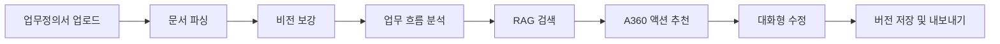
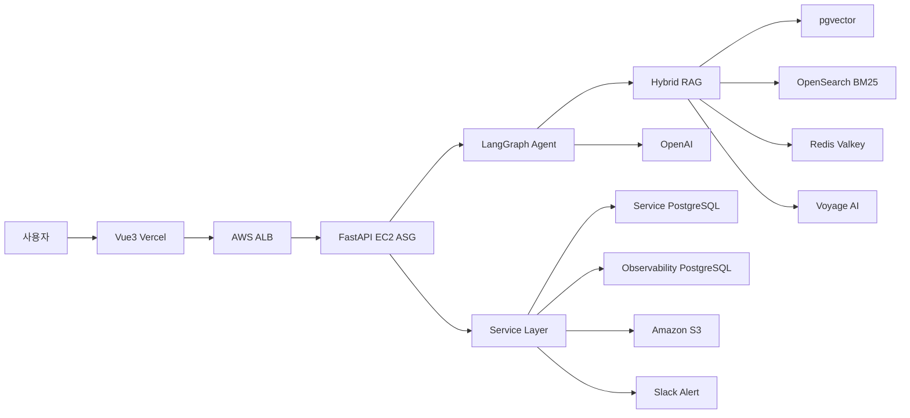
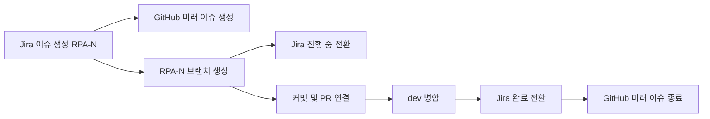
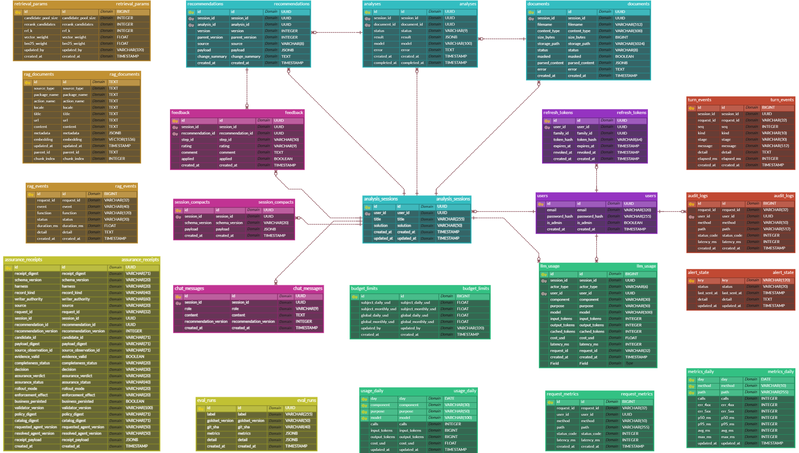

<div align="center">


### 업무정의서에서 실행 가능한 Automation 360 흐름도까지

문서를 분석해 **적용 가능한 A360 작업과 근거를 추천**하고,<br>
대화를 통해 결과를 수정·확정할 수 있는 AI 기반 자동화 설계 지원 플랫폼입니다.


[](https://github.com/Metanet-Final-01/A360-Assistant-Backend/actions/workflows/tests.yml)
[](https://github.com/Metanet-Final-01/A360-Assistant-Backend/actions/workflows/secret-scan.yml)
[](https://github.com/Metanet-Final-01/A360-Assistant-Backend/actions/workflows/change-assurance-warn.yml)

[프로젝트 개요](#프로젝트-개요) · [핵심 기능](#핵심-기능) · [기술 스택](#기술-스택) · [시스템 아키텍처](#시스템-아키텍처) · [개발 성과](#주요-개발-성과) · [API](#api-개요) · [문서](#문서)

</div>

## 프로젝트 개요

| 구분 | 내용 |
|---|---|
| 프로젝트 | **A360 Assistant — A360 흐름도 추천 Agent** |
| 팀 | **1조 MetaFlow** |
| 대상 사용자 | RPA 자동화를 설계하는 현업 담당자와 개발자 |
| 입력 | 업무정의서(PDF·PPTX·PPT·DOCX) 또는 자연어 업무 요청 |
| 출력 | 실행 가능한 A360 작업 흐름도, 단계별 액션, 추천 근거 문서 |
| 백엔드 규모 | **10개 API 대분류 · 60개 API · 22개 테이블 · 203개 컬럼** |

## 기획 배경

RPA 도입 과정에서는 업무정의서를 읽고, Automation 360의 수많은 액션 중 어떤 작업을 조합해야 하는지 판단하는 데 많은 시간이 듭니다. 공식 문서와 기존 봇 사례가 여러 곳에 흩어져 있어 **가능한 액션을 찾는 일**, **작업 순서를 설계하는 일**, **선택 근거를 확인하는 일**도 담당자의 경험에 크게 의존합니다.

A360 Assistant는 이 과정을 다음과 같이 바꿉니다.

- 업무정의서를 구조화해 자동화 대상과 제약조건을 추출합니다.
- A360 공식 문서와 봇 예제를 함께 검색해 실제 존재하는 액션을 추천합니다.
- 추천 결과를 흐름도로 제공하고, 대화로 수정한 모든 버전을 이력으로 남깁니다.
- 추천뿐 아니라 검색 기여도·비용·지연·판정 근거까지 기록해 운영 중 문제를 추적할 수 있게 합니다.

## 서비스 흐름



## 핵심 기능

| 기능 | 설명 |
|---|---|
| **업무정의서 구조화** | PDF·PPTX·PPT·DOCX의 문단과 표를 추출하고, 텍스트가 부족한 페이지는 비전 모델로 보강합니다. |
| **업무 흐름 분석** | 수행 단계, 입력·출력, 제약조건과 추가 확인이 필요한 내용을 구조화합니다. |
| **A360 작업 추천** | 공식 문서와 봇 예제를 벡터 검색·BM25·RRF·리랭킹으로 결합해 실제 액션과 근거를 찾습니다. |
| **대화형 수정** | 사용자가 자연어로 요청하면 기존 흐름도를 수정하고 새 버전으로 저장해 이력과 되돌리기를 지원합니다. |
| **SSE 진행 상황** | 문서 파싱과 Agent 턴의 처리 단계를 실시간으로 전달하며, 연결이 끊기면 Redis Stream 기반 재개를 지원합니다. |
| **운영 관측** | `request_id`로 감사 로그·성능 메트릭·Agent 턴·RAG 이벤트를 연결해 지연, 비용, 검색 기여도와 장애 원인을 추적합니다. |
| **AI 결과 검증** | 코드 변경은 Change Assurance, 추천 결과는 Output Boundary에서 독립 검사하고 판정 근거를 영수증으로 보존합니다. |

## 기술 스택

| 구분 | 기술 |
|---|---|
| **Backend** |     |
| **Authentication** |    |
| **Agent / LLM** |     |
| **RAG / Search** |     |
| **Document** |     |
| **Database / ORM** |     |
| **Cache / Streaming** |    |
| **Storage** |   |
| **Infrastructure** |     |
| **CI/CD & Quality** |     |
| **Monitoring** |     |
| **AI Assurance** |    |
| **Collaboration** |     |

## 시스템 아키텍처



서비스 데이터, 검색 지식베이스, 관측 데이터는 논리적으로 분리했습니다. 관측 저장이나 캐시에 문제가 생겨도 사용자 요청이 함께 실패하지 않도록 주요 부가 경로를 본 요청에서 격리했습니다.

## 주요 개발 성과

### 1. 연결 상태가 아닌 실제 검색 기여도를 관측

API는 `200 OK`이고 OpenSearch 연결도 정상이었지만, BM25 후보가 0건이라 검색이 `dense-only`로 동작하는 무음 저하를 발견했습니다.

- `available`과 `contributed`를 서로 다른 신호로 기록
- 벡터·BM25·리랭킹 단계별 후보와 기여도 저장
- 폴백 이력과 기능별 RAG 진단 API 제공
- 에러가 없다는 사실과 정상 동작을 분리해 판단

### 2. 측정 결과를 기준으로 검색·관측 병목 개선

검색 1회에서 외부 API 왕복에 **4,059ms**가 사용되고 있음을 확인한 뒤, DB 쿼리보다 왕복 횟수와 반복 작업을 먼저 줄였습니다.

| 개선 항목 | 결과 |
|---|---|
| 관측 저장 배치 처리 | **2,327ms → 858ms** |
| 커넥션 풀 재사용 | 요청별 연결 비용 **451ms 제거** |
| 처리량 | **9.4 req/s → 47 req/s** |

### 3. 결과 일관성과 장애 격리

- 동일 입력의 캐시 키와 검색 설정을 고정해 결과 재현성 확보
- 오래되거나 품질이 낮은 결과는 캐시 저장 대상에서 제외
- 캐시·관측 저장 장애가 본 요청으로 전파되지 않도록 분리
- SSE 연결 종료 후 Redis Stream에서 처리 결과 재개
- 실측 분포를 기준으로 타임아웃을 180초로 조정하고 기능별 진단을 분리

### 4. AI/바이브코딩 보증 하네스

AI가 코드와 테스트, 리뷰까지 모두 생성하면 생성 주체와 판정 주체가 같아집니다. 이를 분리하기 위해 실제 Git 변경 내역을 기준으로 다시 검사하고 판정 근거를 남기는 하네스를 구현했습니다.

| 하네스 | 검사 대상 | 현재 단계 |
|---|---|---|
| Change Assurance | PR의 변경 명세·위험도·의존성·보호 경로·대상 커밋·증거 무결성 | Warn |
| Backend Output Boundary | 추천 결과의 strict schema·catalog closure·제약조건 보존 | Observe |
| Evidence & Governance | 판정 대상·정책·검사기 버전·무결성·업무 저장 결과 | Observe |

필수 증거가 없거나 SHA-256이 다르면 통과로 처리하지 않습니다. 현재는 오탐과 운영 표본을 확인하기 위해 Warn·Observe로 운영하며, 실제 병합이나 저장을 차단하는 Enforce는 별도 승인 후 적용합니다.

### 5. 긴 대화의 컨텍스트 자동 압축

토큰이 임계치에 도달하면 오래된 대화를 단순 삭제하지 않고 진행 작업, 확정된 결정, 흐름 변경, 미결 사항과 필요한 원문을 구조화해 압축합니다. 압축 결과는 `session_compacts`에 저장해 다음 턴에서도 작업 맥락을 이어갑니다.

### 6. 하이브리드 RAG 검색과 배포 기반 구축 — 김동환

벡터 검색과 키워드 검색 중 하나에 의존하지 않도록 검색 경로를 재구성하고, 동일한 구성이 실제 AWS 환경에서도 동작하도록 배포 기반까지 연결했습니다.

- pgvector 벡터 검색과 OpenSearch BM25를 병렬 실행하고 RRF로 결과 통합
- Voyage AI 리랭킹을 적용해 1차 검색 후보의 최종 순서 재조정
- 사이트 메뉴 기반 문서 크롤링과 액션 참조 데이터 구조화
- RAG 수집 스케줄러와 외부 RAG·관측·검색 DB를 배포 구성에 연결
- CloudFormation 기반 백엔드 배포 분리와 Redis·OpenSearch 설정 주입

관련 작업: [RPA-9 — 하이브리드 검색·리랭킹](https://metanetfinal.atlassian.net/browse/RPA-9), [RPA-94 — 문서 크롤러 구조화](https://metanetfinal.atlassian.net/browse/RPA-94), [RPA-274 — RAG 캐시 배포 설정](https://metanetfinal.atlassian.net/browse/RPA-274)

### 7. 단계형 Agent 생성·검수 파이프라인 고도화 — 정준환

한 번의 LLM 응답에 흐름도 전체를 맡기지 않고 생성·검수·수리를 단계로 나눠, 잘못된 결과를 다음 단계에서 보완할 수 있는 Agent 파이프라인을 만들었습니다.

- 흐름도 생성을 구조·능력 요청·게이트·값의 4단계로 분리
- 수리 라운드의 실패 원인을 다음 라운드 입력에 전달해 반복 오류 감소
- 검수 전 구조 초안을 SSE로 먼저 전달해 긴 생성 구간의 진행 상태 표시
- 검색 근거를 기준으로 신뢰도를 계산하고 근거 없는 0점·기본 점수 승격 방지
- 타 솔루션 카탈로그 448개를 규칙 기반으로 전량 인식하고 추출 LLM 호출 없이 후보로 사용

관련 작업: [RPA-298 — 흐름도 품질 루프](https://metanetfinal.atlassian.net/browse/RPA-298), [RPA-370 — 초안 스트리밍](https://metanetfinal.atlassian.net/browse/RPA-370), [RPA-371 — 수리 오류 피드백](https://metanetfinal.atlassian.net/browse/RPA-371), [RPA-376 — 타 솔루션 카탈로그 지원](https://metanetfinal.atlassian.net/browse/RPA-376)

## 팀원 및 역할

| 이름 | 역할 | 담당 |
|---|---|---|
| 김동환 | PM / RAG | RAG 검색 단계 구축·평가, 흐름도 평가 하네스, AWS·CI/CD |
| 홍승민 | Backend | API·DB, 인증, 문서 처리, SSE, 로그·관측 체계, AI 코드 검증 하네스 |
| 정준환 | Agent | RAG 적재 파이프라인, LangGraph Agent 구현 |
| 김민석 | Frontend | Vue 3 SPA와 사용자 화면 구현 |

## Jira ↔ GitHub 협업 연동

Jira를 이슈 원본으로 사용하고, GitHub의 브랜치·커밋·PR 상태를 Jira 개발 패널과 자동으로 연결했습니다.



- 브랜치명·커밋·PR 제목의 `RPA-N` 키를 Jira 개발 패널에 자동 연결
- Jira 이슈 생성 시 GitHub 미러 이슈 생성, Jira 완료 시 미러 이슈 종료
- 브랜치 생성 시 `진행 중`, PR 병합 시 `완료`로 상태 자동 전환
- PR 제목 검사·Secret Scan·테스트를 통과한 변경만 `dev` 병합 대상으로 관리

상세 규칙: [Jira ↔ GitHub 연동 가이드](docs/JIRA_GITHUB.md)

## 빠른 시작

**요구사항**: Python 3.11+, Docker Desktop

```bash
git clone https://github.com/Metanet-Final-01/A360-Assistant-Backend.git
cd A360-Assistant-Backend

# 1) 환경변수 — OPENAI_API_KEY만 채우면 시작 가능
cp .env.example .env

# 2) 의존성
pip install -r requirements.txt -r requirements-dev.txt

# 3) DB (pgvector Postgres)
docker compose up -d db
#    ⚠️ 로컬 5432 포트가 사용 중이면: .env에 DATABASE_PORT=5433 설정 후 다시 실행

# 4) RAG 지식베이스 복원 (임베딩 포함 덤프 — 팀 공유 채널에서 수령)
#    절차: app/rag/TEAM_SETUP.md 의 "경로 A"

# 5) 서버 실행 (기동 시 Alembic 마이그레이션이 head까지 자동 적용됨)
uvicorn app.main:app --reload
```

> **기존 DB(Alembic 도입 전에 만든 DB)를 쓰던 팀원**은 최초 1회만:
> `alembic stamp head` (이미 테이블이 있으니 현재 상태로 표시). 그 뒤부터는 `upgrade`가 알아서 처리합니다.

확인: http://localhost:8000/docs (Swagger UI)

전체를 컨테이너로 띄우려면: `docker compose up` (backend + db)

## 데이터베이스

### 3계통 분리

역할이 다른 데이터를 한 DB에 섞지 않습니다. 하나가 죽어도 나머지가 살아남고, 접근 권한과 백업 주기를 따로 가져갈 수 있습니다.

| 계통 | 환경변수 | 담는 것 |
|---|---|---|
| **서비스** | `DATABASE_*` | 사용자·세션·문서·분석·추천 버전·대화 |
| **RAG** | `RAG_DATABASE_URL` | `rag_documents` (임베딩 포함 지식베이스) |
| **관측** | `OBSERVABILITY_DATABASE_URL` | LLM 사용량·감사 로그·요청 지표·RAG 이벤트 |

> 관측 DB는 **미설정 시 비활성**입니다(쓰기 실패가 요청을 막지 않음). 다만 조용히 유실되지 않도록 `/api/health`에 상태가 드러납니다.

### ERD

서비스·RAG·관측 데이터의 전체 테이블과 주요 관계입니다.



### 마이그레이션 (Alembic)

스키마의 단일 진실 공급원은 `migrations/`의 Alembic 마이그레이션입니다 (앱은 부팅 시 `upgrade head` 자동 실행).

```bash
# 모델(app/models.py)을 바꾼 뒤 마이그레이션 생성 (DB에 반영 X, 파일만 생성)
alembic revision --autogenerate -m "무엇을 바꿨는지"
# 생성된 migrations/versions/*.py를 반드시 검토한 뒤 적용
alembic upgrade head        # 최신까지 적용
alembic downgrade -1        # 한 단계 되돌리기
alembic current / history   # 현재 리비전 / 이력
```

현재 **0021**까지 있습니다. 전체 이력은 `alembic history`로 확인하고, 큰 흐름만 적으면 이렇습니다.

| 구간 | 내용 |
|---|---|
| `0001`–`0007` | 도메인 8개 테이블, 사용자·인증, 세션 소유자, 대화 압축 |
| `0008`–`0013` | **관측 계통** — 요청 지표, 일별 롤업, 턴 이벤트, RAG 이벤트, 검색 파라미터 오버라이드 |
| `0014`–`0018` | LLM 사용량 정밀화 — 요청 ID 귀속, 예산 인덱스·한도, 경보 상태, 캐시 토큰 |
| `0019` | 리프레시 토큰 (RPA-200) |
| `0020`–`0021` | **보증 영수증** — 판정 근거 영속화와 결정값 제약 (RPA-182) |

- `rag_documents`는 `app/rag`가 원시 SQL(pgvector)로 관리하므로 Alembic 대상에서 제외돼 있습니다 (`migrations/env.py`).
- 컬럼 추가·변경 시 `create_all`처럼 조용히 누락되지 않고, 마이그레이션 파일로 이력이 남습니다.

## 설정 — config 레지스트리

환경변수는 흩어진 `os.getenv` 호출이 아니라 **`app/core/config.py`의 레지스트리에 선언**합니다. 현재 약 130개 키가 등록돼 있습니다.

```python
# 선언하지 않은 키를 쓰면 CI 래칫이 막습니다
from app.core import config
timeout = config.get_int("RAG_SEARCH_TIMEOUT_MS")
```

**두 가지 규칙이 있습니다.**

1. **새 환경변수는 레지스트리 선언이 먼저입니다.** 선언 없이 쓰면 CI에서 실패합니다. 어떤 값이 이 서비스의 동작을 바꾸는지가 한곳에 모입니다.
2. **시작 시점이 아니라 호출 시점에 읽습니다.** 값을 부팅 때 객체로 굳히지 않기 때문에, 테스트에서 값을 바꿔 끼우며 검증할 수 있고 운영 중 변경도 다룰 수 있습니다. 이게 계약이라 `BaseSettings` 류는 쓰지 않습니다.

`.env.example`에는 실제로 자주 설정하는 41개만 있습니다. **전체 목록과 기본값은 레지스트리가 정본입니다.**

## 테스트

```bash
python -m pytest -q                                  # 전체
pytest -q --cov=app --cov-report=term-missing        # 커버리지 포함 (CI와 동일)
pytest -q -n auto                                    # 병렬 (로컬 권장)
```

> **느리면 코드보다 환경을 먼저 의심하세요.** 로컬 postgres 컨테이너가 내려가 있으면 모든 DB 접근이 연결 대기에 걸려 전체 실행 시간이 수십 배로 늘어납니다. 단일 테스트 파일 하나만 돌려 보면 바로 드러납니다.

PR을 올리면 CI가 **pytest·커버리지·PR 제목 검사·시크릿 스캔·라벨링·변경 보증**을 자동 실행합니다.

## 보증 하네스 (Change Assurance)

AI로 개발하면 속도는 빨라지지만 검증이 따라가지 못합니다. 그래서 **AI가 만든 변경이 정해진 경계를 넘지 않았는지 자동으로 판정하고, 그 판정 근거를 영수증으로 남기는** 체계를 두었습니다.

| 하네스 | 묻는 것 |
|---|---|
| Change Assurance | 이 코드 변경을 병합해도 되는가 |
| Backend Output Boundary | Agent 출력과 사용자 편집본을 저장·조회·내보내도 되는가 |
| Evidence & Governance | 그 판정이 어떤 입력·정책·환경에서 나왔는가 |

**한 번에 차단으로 켜지 않았습니다.** 오탐 하나가 팀 전체를 멈추기 때문에 **관찰 → 근거 저장 → 경고 → 차단** 순으로 승격했습니다. 각 단계가 별도 PR이라 중간에서 멈춰도 "지금 무엇이 경계를 넘고 있는지"는 남습니다.

- CI: `.github/workflows/change-assurance-warn.yml`, `change-assurance-publish.yml`
- 영수증 저장: `assurance_receipts` 테이블 (마이그레이션 `0020`–`0021`)
- 조회: `GET /api/admin/assurance-receipts`
- 되돌리기 절차: [docs/runbooks/change-assurance-rollback.md](docs/runbooks/change-assurance-rollback.md)
- 배경과 설계: [assurance/README.md](assurance/README.md)

## 관측

만든 것이 실제로 도는지 확인할 수 없으면 만든 게 아닙니다. 세 가지 목적으로 기록합니다.

| 목적 | 기록 | 조회 |
|---|---|---|
| **비용 거버넌스** | 호출별 토큰·비용을 기능(component)·모델·사용자별로 귀속 | `GET /api/admin/llm-usage/stats`, `/usage-daily` |
| **감사·추적** | 누가 언제 무엇을 바꿨는지, 턴 단위 이벤트 | `/audit-logs`, `/turn-events` |
| **운영 신뢰성** | 엔드포인트별 p50/p95·에러율, RAG 단계별 기여도 | `/request-metrics`, `/metrics-daily`, `/rag-events` |

- 일별 롤업은 APScheduler가 **멱등**(같은 날짜를 여러 번 돌려도 결과 동일)하게 수행합니다.
- 예산 한도를 넘거나 상태가 나빠지면 슬랙으로 경보가 갑니다(`SLACK_WEBHOOK_URL`). 서버를 여러 대 띄워도 **한 번만** 발송되도록 발송 전에 원자적으로 선점합니다.
- 정책·스키마 상세: [docs/OBSERVABILITY_DB.md](docs/OBSERVABILITY_DB.md), [docs/OBSERVABILITY_POLICY.md](docs/OBSERVABILITY_POLICY.md)

## API 개요

### 인증·세션

| 메서드/경로 | 설명 |
|---|---|
| `GET /api/health` | 헬스 체크 (관측·RAG 연결 상태 포함) |
| `POST /api/auth/register` | 회원가입(201) → `{access_token, refresh_token}` |
| `POST /api/auth/login` | 로그인 → 토큰 쌍. 이후 요청은 `Authorization: Bearer <access_token>` |
| `POST /api/auth/refresh` | `{refresh_token}` → 새 토큰 쌍. 액세스 만료(기본 60분) 시 **재로그인 없이** 갱신 (RPA-200) |
| `POST /api/auth/logout` | `{refresh_token}` 폐기(204, 멱등) |
| `GET /api/auth/me` | 현재 사용자 — 토큰 유효성 확인용 |
| `POST /api/sessions` · `GET /api/sessions` | 빈 세션 생성 / 내 세션 목록 |
| `GET · DELETE /api/sessions/{id}` | 세션 상세 / 삭제(CASCADE) |
| `GET /api/sessions/{id}/chat-messages` | 대화 이력 |

### 문서

| 메서드/경로 | 설명 |
|---|---|
| `POST /api/documents` | 업로드 → 검증·저장만 하고 즉시 반환(`status="uploaded"`). multipart `file`, 선택 `session_id` |
| `POST /api/documents/{id}/parse` | 파싱 (FR-02·04) — **SSE**. 완료 시 `status="parsed"` |
| `POST /api/documents/text` | 자연어 업무 요청을 문서로 등록 — 파싱 없이 `status="parsed"` |
| `GET /api/documents/{id}` · `/content` | 메타·처리 상태 / 파싱 결과(구조화 JSON) |
| `POST /api/documents/{id}/enrich-vision` | 이미지 중심 페이지를 비전 LLM으로 보강 (FR-03) — **SSE** |

### 분석·추천

| 메서드/경로 | 설명 |
|---|---|
| `POST /api/sessions/{id}/turn` | **에이전트 단일 진입점** — 분석·질문·흐름도 생성/수정, `operation="compact"`면 대화 압축 — **SSE** |
| `GET /api/sessions/{id}/analyses` · `/latest` | 분석 목록(메타) / 최신 분석 전체 결과 |
| `GET /api/sessions/{id}/recommendations` · `/latest` | 추천안 버전 목록(undo·이력) / 최신 트리(흐름도 렌더용) |
| `POST /api/sessions/{id}/recommendations` | 편집한 추천안을 **새 버전으로** 저장 (FR-18) |
| `GET /api/sessions/{id}/recommendations/{version}/export` | 확정본 JSON 내보내기 (FR-17) |
| `GET /api/agent/versions` | 사용 가능한 에이전트 버전 목록 |
| `GET /api/catalog/packages` | A360 패키지 카탈로그 |

### 검색

| 메서드/경로 | 설명 |
|---|---|
| `GET /api/rag/search?q=&limit=` | A360 액션/문서 하이브리드 검색 (FR-07) |
| `GET /api/rag/debug/*` | 단계별 진단 — `embed`·`vector-search`·`bm25-search`·`rerank`·`search-actions`·`status` |
| `GET /api/rag/logs/recent` | 최근 검색 이벤트 |

> 디버그 라우터는 **명시적으로 켜야만 열립니다**(기본 비활성). 실수로 프로덕션에 노출되지 않도록 fail-closed입니다.

### 운영 (관리자)

| 메서드/경로 | 설명 |
|---|---|
| `GET /api/admin/llm-usage/stats?days=&group_by=` | LLM 사용량 집계 (component/model/user별) |
| `GET /api/admin/usage-daily` · `/metrics-daily` | 일별 롤업 |
| `GET /api/admin/request-metrics` | 엔드포인트별 p50/p95·에러율 |
| `GET /api/admin/turn-events` · `/rag-events` | 턴·RAG 단계 이벤트 |
| `GET /api/admin/audit-logs` | 감사 로그 |
| `GET /api/admin/assurance-receipts` · `/{digest}` | 보증 영수증 목록·상세 |
| `GET · PUT /api/admin/retrieval-params` | 검색 하이퍼파라미터 오버라이드 |
| `GET · PUT /api/admin/budget-limits` | 예산 한도 |
| `GET /api/admin/rag/health` · `POST /rag/probe` | RAG 상태 점검·프로브 |

### 흐름과 규약

> 전체 흐름: `POST /documents`(저장) → `/parse`(SSE) → `POST /sessions/{id}/turn`(SSE — 분석·추천·질문·수정을 하나로) → 프론트가 트리를 블록으로 렌더·편집 → `POST /sessions/{id}/recommendations`(편집본 새 버전). 자연어는 `POST /documents/text`로 바로.
>
> 대화형(FR-05, 09~16)은 **`POST /sessions/{id}/turn` 하나로** 처리합니다. 백엔드가 세션에서 full context(solution/operation/history/compact/analysis/recommendation/parsed_doc)를 조립해 에이전트에 넘기고, 에이전트가 `solution`으로 그래프를 골라 intent를 판단합니다. 반환 `type`(answer/analysis/recommendation/compact)으로 백엔드가 저장을 분기합니다. (레거시 `/analyze`·`/recommend`·`/api/agent/chat`은 흡수·제거됨, RPA-67)
>
> 대화 누적 게이지: `done.data.usage_gauge`(`intake_tokens`·`limit_tokens`·`ratio`·`compact_recommended`) — 턴 첫 LLM 호출의 프롬프트 토큰 기준. `compact_recommended`면 프론트가 대화 압축을 유도합니다(임계 `TURN_GAUGE_LIMIT_TOKENS`, RPA-83).
>
> 흐름도 = `Recommendation` 트리(steps→actions→children). 수정은 UPDATE가 아니라 **새 버전 INSERT**라 undo·이력이 자연히 나옵니다.

- 에러 응답은 `{"detail": {"code": "...", "message": "사용자용 한글 메시지"}}` 형식. 스키마 검증 실패(`INVALID_RECOMMENDATION`)는 어느 필드가 왜 틀렸는지 `errors`를 덧붙입니다 — `[{"field": "steps.0.actions.0.order", "reason": "Field required"}]` (최대 10건, 원문 반향 방지로 입력값 미포함, RPA-166)
- 지원 형식: **PDF·PPTX·PPT·DOCX**. 표는 `{"type":"table","rows":[...]}`로 구조화 추출(PPTX·DOCX는 셀 단위, PDF는 pdfplumber). 레거시 `.ppt`는 LibreOffice(`soffice`)로 변환 후 파싱 — 배포 이미지에 LibreOffice 필요(`LIBREOFFICE_PATH`), 없으면 "PPTX로 저장 후 업로드" 안내
- 업로드 검증: 확장자·크기(기본 20MB)·매직바이트 위조·PDF 실행형 요소·OOXML 매크로 차단

### SSE 소비 방법 (프론트)

시간이 걸리는 작업은 `ProgressEvent` 규약(stage→partial→done/error)으로 스트리밍됩니다.
POST 엔드포인트라 EventSource 대신 **fetch 스트리밍**을 사용합니다:

```js
const res = await fetch(`/api/documents/${id}/enrich-vision`, { method: "POST" });
const reader = res.body.pipeThrough(new TextDecoderStream()).getReader();
// 청크에서 "data: {...}" 라인을 파싱해 event 필드로 분기
```

이벤트 규약 상세: [docs/INTERFACES.md](docs/INTERFACES.md) §5

## 프로젝트 구조

```
app/
├── main.py          앱 조립 (CORS·lifespan·라우터)
├── api/             HTTP 라우터 (얇게 — 로직은 services로)
│                    auth·documents·sessions·agent·rag·catalog·admin·debug·assurance_writer
├── services/        비즈니스 로직: 업로드 검증·저장소(S3/로컬)·문서 파서(+비전)·롤업·경보
├── core/            공용 인프라: 설정 레지스트리·LLM 래퍼·관측 DB·마스킹·스케줄러·보안
├── db.py, models.py DB 세션·ORM (도메인 + 관측 + 보증 영수증)
├── schemas/         도메인 JSON 계약: AnalysisResult·Recommendation·ProgressEvent
├── agent/           LangGraph 오케스트레이터 (Agent 담당 영역)
├── ingest/          RAG 원천 수집 CLI
└── rag/             RAG 검색 (sources 수집, build 정규화, store 저장, retrieval 하이브리드)

assurance/           AI 변경 보증 — 설계·증거·영수증 계약
migrations/          Alembic 스키마 이력 (0001–0021)
infra/               CloudFormation 배포 템플릿
scripts/             운영 스크립트 (공유 DB 토글·마이그레이션 등)
tests/               pytest
```

## 문서

| 문서 | 내용 |
|---|---|
| [docs/CONVENTIONS.md](docs/CONVENTIONS.md) | 브랜치·커밋·PR 컨벤션, 작업 흐름 |
| [docs/INTERFACES.md](docs/INTERFACES.md) | 백엔드↔Agent 함수 계약, 산출물 JSON 스키마, SSE 규약 |
| [docs/OBSERVABILITY_DB.md](docs/OBSERVABILITY_DB.md) | 관측 DB 스키마와 각 테이블이 답하는 질문 |
| [docs/OBSERVABILITY_POLICY.md](docs/OBSERVABILITY_POLICY.md) | 무엇을 기록하고 무엇을 마스킹하는가 |
| [docs/RAG_CATALOG.md](docs/RAG_CATALOG.md) | 수집된 A360 패키지·액션 카탈로그 (자동 생성) |
| [docs/JIRA_GITHUB.md](docs/JIRA_GITHUB.md) | Jira↔GitHub 자동화 연동 |
| [docs/runbooks/](docs/runbooks/) | 운영 절차 — 변경 보증 되돌리기 |
| [assurance/README.md](assurance/README.md) | AI 변경 보증 체계의 배경·설계·한계 |
| [app/rag/README.md](app/rag/README.md) | RAG 수집·하이브리드 검색 사용법 |
| [app/agent/README.md](app/agent/README.md) | 에이전트 그래프 구조 |
| [AGENTS.md](AGENTS.md) | AI 코딩 도구용 작업 규칙 |

## 환경변수

전체 목록과 기본값은 **`app/core/config.py` 레지스트리**가 정본이고, `.env.example`에는 자주 쓰는 것만 있습니다. 핵심만 추리면:

| 키 | 용도 |
|---|---|
| `OPENAI_API_KEY` | LLM·임베딩 (필수) |
| `DATABASE_*` | 서비스 DB 접속 (로컬 기본값 제공) |
| `RAG_DATABASE_URL` | RAG 지식베이스 DB (미설정 시 서비스 DB) |
| `OBSERVABILITY_DATABASE_URL` | 관측 DB (미설정 시 관측 비활성) |
| `REDIS_URL` | RAG 검색 캐시 (미설정 시 인메모리) |
| `OPENSEARCH_*` | BM25 검색 (미설정 시 벡터 검색만) |
| `DOCUMENT_BUCKET` | 설정 시 업로드 파일을 S3에 저장 (미설정 시 로컬) |
| `JWT_SECRET`, `ACCESS_TOKEN_EXPIRE_MINUTES`, `REFRESH_TOKEN_EXPIRE_DAYS` | 인증 |
| `VISION_MIN_TEXT_CHARS`, `VISION_MAX_PAGES`, `VISION_CONCURRENCY` | 비전 파싱 비용·성능 가드 |
| `BUDGET_*`, `ALERT_*`, `SLACK_WEBHOOK_URL` | 예산 한도와 경보 |
| `HYBRID_*`, `RRF_*`, `RERANK_MODEL` | 검색 하이퍼파라미터 (운영 중 오버라이드 가능) |

> ⚠️ 시크릿은 코드에 넣지 않습니다. 배포 환경에서는 시크릿 매니저로 주입합니다.
> 그리고 **"코드가 있다"와 "실제로 켜져 있다"는 다른 상태입니다.** 기능을 붙였으면 배포 환경에 값이 실제로 주입됐는지까지 확인하세요.
